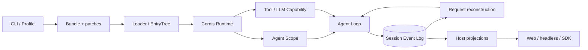
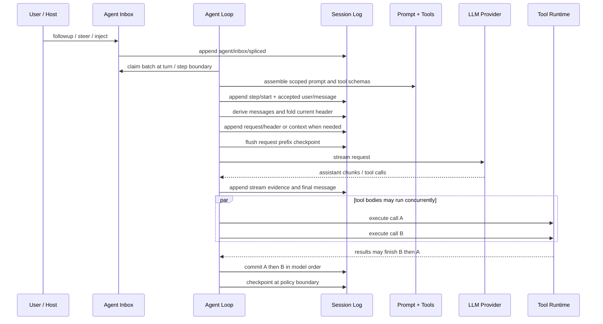

> 这是一份非官方研究。分析固定在 DeepSeek Harness commit [`47f943859bef60e4160492346772ded9b24f765a`](https://github.com/deepseek-ai/deepseek-harness/commit/47f943859bef60e4160492346772ded9b24f765a)，对应仓库当时的 `0.1.0-rc.5` developer preview。此后上游发生的变化，不会被悄悄写回这份首版结论。

如果只看 README，DeepSeek Harness 很像一套“全部功能都由插件组成”的 Coding Agent。这个描述没有错，但没有解释两个麻烦问题：插件如何活着、如何彼此隔离；模型下一次请求又如何确认之前发生过什么。

我把它概括成两套互相咬合的内核：

- **Cordis 是运行时内核**。它管理插件、服务、事件、作用域和清理责任。
- **Session Event Log 是事实内核**。它管理模型看过什么、工具做过什么，以及崩溃后能恢复什么。

Agent Loop 夹在中间。它并不拥有大多数策略，只负责把“当前运行时能力”和“已经提交的事实”重新组装成下一步行动。

这篇文章会先讲清这张总图，再回答三个更难的问题：当前架构怎样工作；它为什么演进成这样；独立开发者应该借走什么，又不该照搬什么。

## 先给结论

1. **“Everything is a plugin”不等于没有内核。** 产品能力可以替换，但 Context、Fiber、effect、事件分发和 Session append 仍是框架级机制。
2. **Profile / Bundle 不是普通配置文件。** 它们组成了一门小型装配语言：稳定行 ID、条件表达式、patch 顺序和插件树共同决定最后运行什么。
3. **Agent Scope 同时解决可见性和生命周期。** `agent.ctx` 不只回答“这个 Agent 看见哪些工具”，还回答“这些注册项跟谁一起销毁”。
4. **Agent Loop 的策略很薄，编排却不简单。** 它要处理 turn/step、流式增量、并行工具、顺序提交、取消和恢复，但 prompt、tools、provider、审批等决策都通过服务或事件扩展。
5. **Session Log 不是 `messages[]` 的另一个名字。** 它先记录持久事实，再派生模型消息、UI 投影和请求快照；消息只是众多 read model 之一。
6. **这套架构不是一路堆功能长出来的。** 团队反复删除重复事实源、撤回过宽抽象，并把一度分散在客户端的领域计算重新收回 Host。
7. **文档本身也是工程系统。** 生成目录、类型等价、双语 freshness、链接、Mermaid 和 Agent Note 格式都受 CI 约束；同时，五百多份决策记录也给外部读者制造了新的检索负担。

## 我怎样读这个仓库

研究开始时，远端 `origin/master` 与固定快照一致。仓库有 12,293 个可达提交、972 个 first-parent 提交；排除测试、构建产物、依赖与明显生成物后，源码约 23.7 万行。固定快照的 `docs/` 和 `.agents/notes/` 里还有 1,587 份 Markdown。

所以这不是“从第一行读到最后一行”的项目。我的方法是先确定六个核心系统，再为每个系统建立核心文件清单：

- Cordis Runtime
- Profile / Bundle
- Agent Scope
- Agent Loop
- Session Event Log
- Tool / LLM Capability

六个系统的选定核心文件实际阅读覆盖率都是 100%。这里的 100% 只指**预先选定的核心实现、测试和文档**，不是声称读完了全仓每个 UI 组件。每份模块草稿又交给独立 Agent 做对抗审查，专门寻找行号不支持结论、把历史设计当成现状、把推断写成事实等问题。

正文使用三种证据等级：

- **已证实**：源码、测试、提交说明、Agent Note 或官方文档直接支持。
- **合理推断**：多份独立证据共同支持，但作者没有明说。
- **仍然未知**：仓库材料不足，宁可留下采访问题。

提交历史可以证明设计怎样变化，不能替作者补写心理活动。比如，我们能确认 TUI 被删除，却不能据此编造“因为维护成本太高”。

## 总图：一棵插件树，两种时间

先不要从包名出发。把系统看成两种时间，会更容易理解。



上半部分是**活着的现在**：Profile 选 Bundle，Loader 把配置行变成插件实例，Cordis 维持服务和 effect，Scope 决定某个 Agent 的局部视图。它允许替换、热更新和销毁。

下半部分是**已经发生的过去**：turn、step、request、tool call、tool result 和消息以持久事件存在。它们不能因为一个插件卸载就消失。下一次模型请求、Web UI 的 transcript、冷启动恢复，都要从这条事实流重新派生。

这也是理解架构边界的最快方法：

| 问题 | 主要所有者 |
|---|---|
| 这个插件何时启动、依赖谁、怎样清理？ | Cordis Fiber / effect |
| 这个 Agent 现在能看见哪个工具或 prompt section？ | Agent Scope + scoped registry |
| 这次请求实际用了什么 system prompt、tools 和调用参数？ | `request/header` |
| 工具并发完成后，事实以什么顺序进入历史？ | Agent Loop 的 ordered commit |
| 进程崩溃后，哪些工作算发生过？ | Session Event Log + checkpoint policy |
| UI 应该显示什么？ | Host 从 log 计算的 projection |

Cordis 与 Session Log 并不是竞争的两套状态管理。前者处理**可撤销的运行实例**，后者处理**不可随意撤销的历史事实**。

## 跟着一次输入，走完整条链

一次用户输入大致经过下面这条路径：



这里有四个不太符合直觉的点。

第一，输入先进入 Inbox。队列变更用 `agent/inbox/spliced` 记录；只有等 Loop 在 turn/step 边界 claim 并接受这批输入后，真正的 `user/message` 才进入模型 Surface。Loop 随后从 Session 派生本步请求历史。

第二，System Prompt 与工具 schema 在发请求前才按当前 Agent Scope 组装；实际发送的值又会写进 `request/header`。恢复时不必猜“当时配置大概是什么”。

第三，流式 chunk 是过程证据，最终 `assistant/message` 才是后续请求读取的历史事实。二者都可以记录，却不承担同一种语义。

第四，多个工具 body 可以并行，结果仍按模型发出的 call 顺序提交。否则机器快慢会改变下一次模型看到的对话历史，重放就不再确定。

后面的六个模块，分别在这条链上拥有一段清楚的责任。

<span id="profile-bundle"></span>

## Profile / Bundle：把配置变成装配语言

`dsh` 入口本身很薄。它先定位 Profile，准备模块解析和 CLI patch，再让 Profile 指定的 Bundle 进入 Loader。真正的产品形态不写死在 CLI 里，而是由两层 manifest 和一串有顺序的 patch 组装出来。

可以把它理解成：

```text
base bundle
  + profile defaults
  + home-level overrides
  + CLI patch
  + conditional plugins
  = one Cordis entry tree
```

当前 base、Web 和 headless 共用一套底层能力，但前门不同。Web 加入 Host、RPC 与客户端；headless 加入代码运行入口；Telemetry 等能力只在条件满足时出现。这不是为每种产品复制一份启动代码，而是复用稳定行 ID，对同一棵树做覆盖。

### 稳定 ID 比文件顺序更重要

Loader 的每一行都有稳定 `id`。热更新时，它用 ID 判断“这是同一个插件改了配置”，还是“删掉旧插件、增加新插件”。如果只按数组位置判断，一次插行就可能让后面的所有插件重启。

但这个 ID 只是当前 Loader 的增量更新身份，不是官方承诺的跨版本兼容 ABI。把它暴露给第三方自动化时，需要自己承担快照升级成本。

### Patch 不是深合并

Profile patch 先用稳定 ID 定位一行，再替换这行给出的 entry 字段。若 patch 给出 `config`，替换的是整个 `config` 对象，不会继续深合并；现有 patch 语法也不能直接删除整行。限制多了一些，最终结果却容易追踪：每一层究竟改了哪一行，可以沿 ID 找回去。

空 root 配置也不是废文件。它给用户留出稳定的本地覆盖入口，并让“官方默认”和“用户修改”不必写在同一份文件里。

### 这是强能力，也是信任边界

Loader 支持 `!!js` 条件表达式，当前实现会执行本地 JavaScript。它适合受信任的开发者配置，不是接收陌生输入的安全 DSL。再加上插件本来就能访问进程能力，Profile/Preset 应被视作本地代码装配，而不是低权限数据格式。

这里可移植的产品判断不在 YAML 语法，而在 composition：用可检查的装配层表达多个分发入口，启动函数就不必不断增加产品分支。

证据入口：[Profile 启动链](https://github.com/deepseek-ai/deepseek-harness/blob/47f943859bef60e4160492346772ded9b24f765a/packages/boot/app-boot/src/profile.ts)、[Bundle manifests](https://github.com/deepseek-ai/deepseek-harness/tree/47f943859bef60e4160492346772ded9b24f765a/packages/bundle)、[Loader Entry](https://github.com/deepseek-ai/deepseek-harness/blob/47f943859bef60e4160492346772ded9b24f765a/vendor/loader/src/config/entry.ts)。

<span id="cordis-runtime"></span>

## Cordis：插件怎样变成活着的实例

官方架构文档说“Everything is a plugin”。这句话容易被误读成“没有 privileged core”。更准确的说法是：产品功能不需要进入一个巨大核心，但 Cordis 仍提供不可缺少的运行时机制。

### Context 不只是依赖注入容器

Cordis `Context` 同时携带三类信息：服务所在的 realm、调用者 Context，以及当前 Fiber 的父级关系。`isolate(name, label)` 不是复制一个容器，而是为某个服务名换一枚作用域 symbol。两个子树可以共享同名服务，也可以互相隔离。

这里没有常见 DI 容器的“后注册覆盖前注册”。同一 isolation symbol 已有 Provider 时，第二个 Provider 会报错。两个 Agent 想各自拥有 `shell` 或策略服务，需要进入不同 realm，而不是赌注册顺序。

一个细节很能说明这套系统的复杂度：没有在当前 Fiber 声明 `inject`，不代表任何服务访问都会失败。祖先 Fiber 已持有的依赖可能沿同一 realm 继承；显式 `ctx.get()` 也允许探测可选服务。审查草稿时，我们正是靠反例修掉了“未声明 inject 必然报错”这个过度概括。

### Fiber 把所有权变成可执行规则

每次 `ctx.plugin()` 都创建 Fiber。它保存配置、依赖快照、当前迁移和 disposer。服务注册、事件监听、子插件与自建资源都可以登记成 effect；父 Fiber 卸载时，这些责任沿同一条路径被收走。

这比“每个插件自己实现 `stop()`”更可靠，因为所有权不只写在注释里。它也有边角：同一 effect 内的 disposer 逆序执行，但 sibling effects 的异步清理会重叠。当前 Agent teardown 因而使用一条 memoized 顺序路径：取消 machine、等待 idle、销毁 Agent Scope，最后退出 Agent/Session registry。

### Loader 的事务是补偿事务

热更新不会在一个隔离沙盒里预演插件。候选插件会真实启动，外部副作用可能短暂可见。Context patch 失败时，Loader 会重新应用旧 options；旧 Fiber 已成功卸载、候选启动却失败时，它会尝试重启旧 plugin。补偿也失败会抛出 `AggregateError`。

卸载旧 Fiber 自己就失败是另一条边界：Loader 恢复旧 options 并报告 dispose error，但不会再执行一次“重启旧 plugin”。此时旧运行态是否完整，源码没有保证。

这类语义更接近分布式系统的补偿事务，而不是数据库事务：

1. 尽量在卸载旧插件前完成候选 import。
2. 更新 Fiber 或替换插件，并等待生命周期落稳。
3. Context patch 或候选启动失败时，按对应路径补偿旧状态。
4. 补偿也失败就把原错误和补偿错误一起暴露；dispose 失败则直接报告，运行态不作完整承诺。

Include 还要把同一子树的变更串行化。2026-08-03 的一次 HMR 启动死锁，正是“初次扫描、首次 apply 和 teardown 相互等待”逼出了 per-Include Promise queue。

### 为什么直接 vendor 源码

Cordis 在 2026-06-11、Agent Loop 落地前就以源码形式进入仓库。决策记录的理由很具体：当时依赖 RC 版本，而 Loop 正确性又依赖 Fiber、effect disposal 与 waterfall 的确切行为；项目需要可固定、可本地修补的底座。

后来本地改动触及 Fiber 构造、异步清理、Loader 补偿事务、配置求值时机和 Node HMR 内部接口。到这个阶段，Cordis 已不再是“随时可换的 npm 小库”，而是 DeepSeek Harness 自己承担维护责任的框架边界。这是**合理推断**，仓库没有一份正式文件使用同样措辞。

证据入口：[Cordis Context](https://github.com/deepseek-ai/deepseek-harness/blob/47f943859bef60e4160492346772ded9b24f765a/vendor/cordis/src/context.ts)、[Fiber](https://github.com/deepseek-ai/deepseek-harness/blob/47f943859bef60e4160492346772ded9b24f765a/vendor/cordis/src/fiber.ts)、[Vendor 说明](https://github.com/deepseek-ai/deepseek-harness/blob/47f943859bef60e4160492346772ded9b24f765a/vendor/README.md)、[Loader 韧性决策](https://github.com/deepseek-ai/deepseek-harness/blob/47f943859bef60e4160492346772ded9b24f765a/.agents/notes/implemented/bug-fix/2026-07-20-config-hot-reload-resilience.md)。

<span id="agent-scope"></span>

## Agent Scope：共享基础设施，局部能力

Cordis 解决插件怎样组合，却没有自动回答“同一进程里的 Agent A 为什么看不到 Agent B 的 persona 和工具”。Agent Scope 给共享 registry 增加按 Agent 解析的视图。

当前查找顺序是：

```text
global → preset → agent
```

更近的 layer 覆盖同名项。事件传播方向却相反：agent 事件可以被它的 preset listener 接收，不会跑到 sibling preset。读是从远到近合并，事件是从当前 scope 向祖先接纳。

### 可见性和清理用同一个 Context

`createScope()` 在传入 Context 下挂一个 no-op plugin Fiber，再用派生 Context 标记 scope key。所有通过 `agent.ctx` 注册的工具、prompt section 和 listener，既带着可见性标签，也归这条 Fiber 所有。

API 不需要分别接收 `{ scope, owner }`。可见性和清理归属来自同一个 Context，少了一种把两者配错的可能。

### Preset 从每会话一份，变成 standing mount

第一版 preset 是每个 Session 各 mount 一次。Agent Note 记录过约 3ms、600KB/会话。问题不是这点开销本身，而是冷 transcript presenter、Host projection 等读取者在 live Agent 不存在时，也需要知道那套 composition。

2026-08-08，设计改成 per-preset standing mount：同一 preset 的同一 generation 在进程中只挂一次，多个 Agent 通过 scope parent 加入。文件变化后，新 Agent 加入新 generation；旧 generation 目前要等整棵 Cordis tree teardown 才会回收，并非最后一个旧 Agent 离开就立即销毁。

这带来一个重要约束：同 preset 的插件实例可能被多个 Agent 共享。可变状态必须按 Session 或 Agent 分桶，不能假设“每个会话自动有一个全新插件对象”。当前代码也留着旧 generation 尚未按 joined-agent count 回收的 TODO。

### Scope 不是安全沙箱

Preset YAML 决定装哪些插件，scope-aware registry 决定注册项对谁可见，Cordis isolate 决定同名 service 是否碰撞。三者都不是 OS 权限边界。插件仍运行在同一 Node 进程里，可以直接访问它有权访问的资源。

`AgentPreset.trust` 主要描述来源与编辑策略。用户 preset 可写，系统 preset 受保护；它不在运行时自动限制 shell 或网络能力。

Session 记录选中的 preset ID，却不保存完整 composition generation。因此重启后如果 preset 文件已经变了，仓库不能保证用完全相同的 prompt、tools 与插件版本重现过去。这个复现缺口目前仍在。

证据入口：[Scope 实现](https://github.com/deepseek-ai/deepseek-harness/blob/47f943859bef60e4160492346772ded9b24f765a/packages/core/scope/src/index.ts)、[ScopedLayers](https://github.com/deepseek-ai/deepseek-harness/blob/47f943859bef60e4160492346772ded9b24f765a/packages/core/scope/src/store.ts)、[Agent Presets](https://github.com/deepseek-ai/deepseek-harness/blob/47f943859bef60e4160492346772ded9b24f765a/packages/preset/agent-presets/src/index.ts)、[standing mount 决策](https://github.com/deepseek-ai/deepseek-harness/blob/47f943859bef60e4160492346772ded9b24f765a/.agents/notes/implemented/architecture/2026-08-08-per-preset-standing-mounts.md)。

<span id="agent-loop"></span>

## Agent Loop：策略薄，编排厚

Agent Loop 不是一段 `while (toolCalls.length)`。它是一条可取消、可恢复、可观察的行动链，但大多数产品策略又刻意留在外部。

一轮用户目标是 turn；同一 turn 里，每次模型请求是 step。模型发出 tool call 后不会开启新 turn，而是在工具结果提交后进入下一个 step。这个两层模型让 UI、恢复和预算策略都能区分“用户的一轮工作”和“模型内部的一次推进”。

### 每一步都从日志重新派生

Loop 不把一份活着的 conversation array 当权威。每个候选 step 先 claim Inbox，并按当前 Scope 组装 System Prompt 和 tools；pre-step 接受后，Loop 写入本步消息，再从 Session Log 派生模型历史。最终物化的 system、tools 与 request options 进入 `request/header`。

这条链保证“模型可见内容能从持久事实重建”，但不要把 invariant 说得过头：运行时 invariant 使用 live Session 缓存，只核对部分 header 字段；独立 fresh-Session 重建主要由测试证明。对抗审查正是在这里修掉了草稿中的错误表述。

### 工具并行，提交有序

模型一次可以发出多个工具调用。Tool body 允许并发执行，减少总等待时间；Loop 收集结果后，按模型 call 顺序 append。执行完成顺序是机器偶然性，模型顺序才是对话语义。

这是一条很适合独立项目直接复用的规则：

```text
parallel execution + deterministic commit = speed without replay drift
```

### 停止不是 `abort()` 返回的瞬间

取消可能来自用户、父 Agent、provider 或 teardown。当前 live 写入会保留嵌套 cause；旧磁盘记录缺少 caller 时，导入兼容层才映射成 `legacy`。不能把旧设计 Note、现行格式和兼容逻辑混成一套规则。

同样，旧 Note 曾写“Loop 每个 turn 末 flush”，当前 Loop 已不直接调用 `flush()`。持久化屏障属于 `session-checkpoint-policy`。这不只是代码搬家，而是职责收紧：Loop 发出生命周期事实，checkpoint policy 决定哪些边界必须让内存与磁盘追平。

### Loop 故意不拥有的东西

- 不直接选择某个 LLM SDK；它请求统一 LLM service。
- 不维护全局工具表；它读取当前 Agent Scope 的 Tool view。
- 不把审批写死在循环；`tools/execute` waterfall 可以包装执行。
- 不拥有持久化时机；checkpoint policy 监听边界。
- 不重复计算 UI transcript；Host projection 从日志派生。

薄的是 policy ownership，不是错误处理的行数。

证据入口：[Agent Loop](https://github.com/deepseek-ai/deepseek-harness/tree/47f943859bef60e4160492346772ded9b24f765a/packages/core/agent-loop/src)、[Agent 生命周期文档](https://github.com/deepseek-ai/deepseek-harness/blob/47f943859bef60e4160492346772ded9b24f765a/docs/agent-lifecycle.md)、[Checkpoint Policy](https://github.com/deepseek-ai/deepseek-harness/tree/47f943859bef60e4160492346772ded9b24f765a/packages/session/session-checkpoint-policy)。

<span id="session-log"></span>

## Session Event Log：`messages[]` 只是它的一种读法

一份 `messages[]` 只能回答“下一次给模型看什么”。它回答不了模型是怎样流式输出的、工具是否真正开始、压缩前的对话还能否给人看、当时用了哪份 prompt 和 schema，以及崩溃后哪个 turn 算完整。

Session 把问题拆成三层：

| 层 | 保存什么 | 是否权威 |
|---|---|---|
| `SessionHeader` | ID、格式、cwd、fork lineage、初始 preset | 是，但位于日志旁边，不是 event |
| `SessionEvent[]` | 交互中发生过的持久事实 | 是，append-only truth |
| Read models | messages、transcript、request state、title、todo、goal | 否，可从日志重算 |

### `append()` 的提交线在哪里

调用方传入的数据不会直接塞进日志。`append()` 先复制 JSON snapshot，检查 Request Header 兼容性与重入，再冻结候选事件、验证 Surface，并解析这次要通知的监听器。真正的提交线是 `log.push(event)`：

```text
borrowed input
  → JSON snapshot + header compatibility
  → reentry check + deep freeze
  → validate Surface + resolve observers
  → log.push(event)          ← committed in memory
  → notify observers
  → enqueue persistence      ← durable later
```

提交前失败，log 不变；提交后某个 observer 抛错，只记 warning，不能把事实撤回。这样 observer 不能通过偶然异常制造“前一个监听器看见了，后一个却认为没发生”的模糊状态。

`append()` 返回也不等于已经落盘。Persistence 先把事件放入 write-behind queue，默认用 200ms 固定窗口批量写。第一条事件启动 deadline，后来的事件加入同一批但不延长 deadline，所以持续 streaming 不会把落盘时间无限往后推。

需要耐久保证时，调用方显式 `flush()`。Checkpoint policy 在模型 adapter 真正发请求前、顶层工具真正产生副作用前，以及下一次 `agent/pre-step` waterfall 放行前设置屏障。可以把这套保证记成一句话：**普通 chunk 追求低延迟，外部副作用边界 fail-closed。**

200ms 不是“最多只丢 200ms 数据”的 SLA。事件循环阻塞、I/O 排队和 backend 失败都可能延长实际时间；只有成功返回的 flush 才是耐久性保证。

### Surface：事实不删，模型视图可以替换

只有 `user/message`、`assistant/message` 和 `tool/result` 进入模型 Surface。turn、step、chunk、request 和插件自有事件仍在日志里，却不会自动变成 prompt token。

Surface 支持两种操作：

- `append`：把一个消息节点加到尾部。
- `replace(start, end)`：用新节点遮蔽一段旧 Surface，并记录全部来源 seq。

Compaction 因此可以让模型只看摘要，又不删除原始对话。人类 transcript 读取 append-origin events，而不是当前 Surface；否则压缩一发生，用户已经看过的历史会从屏幕消失。仓库确实出现过这类 bug，并在 commit [`d9a11dc91e`](https://github.com/deepseek-ai/deepseek-harness/commit/d9a11dc91e) 后把两个视图拆开。

`deriveMessages()` 只是增量缓存。普通 append 只处理新节点，一旦 replace generation 改变就重建。缓存可以删，日志才是权威。

### 请求可重建，不等于环境可复现

模型请求还需要 system prompt、tool schemas、model 和采样参数。Loop 用 `request/header` 保存已经物化的请求字段。第一个 Loop 实例写 `initial`，新实例接手旧日志写 `resume`，同一实例内值变化写 `change`；Header 不变的请求沿用前一个 epoch。

所以，**一条 `request/header` 不是一次模型调用的逐请求 marker**。我们的 fixture 恰好有两个 Header，是因为第二步的 `reasoningEffort` 发生变化。审计每次 dispatch 时，需要先找真实调用前缀，再折叠当时最新 Header。

请求重建也有边界：日志能还原当时发给 provider 的值，却没有保存插件源码、完整 Bundle/Profile 或 Provider 实现。代码与 composition 改变后，它适合审计旧请求，不保证重新执行得到字节级相同的行为。

### 恢复与 fork 为什么不截断事实

Fork 只接受完整 turn 的前缀。开放 step 可能留下未配对 tool call，从中间 fork 会让 child 一出生就拿到 provider 无法接受的 transcript。

冷启动遇到已经完整写入、但没有正常闭合的 turn，也不会把整段删掉。恢复逻辑会给悬空工具补明确的错误 result，再补 `step/end` 和 `turn/end { kind: 'interrupted' }`：

- 已记录 tool call，却不知道外部副作用是否发生：`TOOL_OUTCOME_UNKNOWN`。
- 模型只声明了 call，Harness 还没记到开始：`TOOL_NOT_STARTED`。

系统不替用户猜副作用结果。它保留已经发生的证据，再把不知道的部分写成明确的错误结果。

### Host Projection：同一领域 fold 只写一次

Title、todo、goal 等 UI 状态也从 Session 事件折叠。当前架构让 Host 成为单一计算点：history tail 带 baseline 和 `asOfSeq`，之后通过带 seq 的 projection value 推送；客户端只做“更高 seq 胜出”，不再理解每个领域事件。

Projection cache 可以让冷列表和冷读取更快，每一行都带 `stateVersion` 与 watermark。行缺失、版本不符、身份不符或 watermark 越过日志末尾时，冷读会丢掉不可用状态并从日志重算；存储域或 schema 本身损坏，并不保证能静默降级。

普通 live 写入会先截取 projection checkpoint，再 flush Session，最后写 cache，因此 cache 可以落后，不能领先日志。Detach 是例外：Session 已经从 store 移除，这条路径跳过 live `flush()`，依靠 Persistence retirement drain 收尾；若 cache 短暂越过耐久日志，后续 cold restore 会用 anchored floor 检出并全量重算。

这里也有一个值得警惕的失效边界。Projection units 在同一个顺序循环里执行；一个 unit 的 `apply()`、`view()` 或 schema 抛错时，事件已经进入日志，前面的 unit 可能推进，后面的 unit 可能漏掉这条事件。当前实现没有每 unit 独立补跑队列，普通 history 的 projection failure 也可能让整个 handler 失败。**Host 单点计算减少了双实现漂移，却也把纯函数、同步、便宜和不抛错变成硬约束。**

证据入口：[Session](https://github.com/deepseek-ai/deepseek-harness/tree/47f943859bef60e4160492346772ded9b24f765a/packages/core/session/src)、[Surface](https://github.com/deepseek-ai/deepseek-harness/blob/47f943859bef60e4160492346772ded9b24f765a/packages/core/session/src/surface.ts)、[Persistence](https://github.com/deepseek-ai/deepseek-harness/tree/47f943859bef60e4160492346772ded9b24f765a/packages/session/session-persistence/src)、[Projection](https://github.com/deepseek-ai/deepseek-harness/tree/47f943859bef60e4160492346772ded9b24f765a/packages/session/session-projection/src)。

<span id="capabilities"></span>

## Tool / LLM Capability：稳定边界怎样容纳不同实现

模型和工具来自哪里？DeepSeek API、第三方模型库、本地 Bash 为什么可以替换，却不需要把 Loop 写成一串 provider 分支？

仓库反复使用一组很朴素的三角色模型：

```text
Service Definition  ← 稳定合同
Service Provider    ← 可替换实现
Consumer            ← 只依赖合同的调用方
```

它不是为了形式整齐而拆包。判断标准是三者能否以不同速度变化。Shell 最清楚：`dsh-shell` 定义进程执行合同，`bash-local` 提供本地实现，`tool-bash` 把它投影成模型看得懂的工具。换成 sandbox provider 时，不必修改模型 schema；改变工具文案时，也不必污染底层进程接口。

### ToolRuntime：定义、模型投影与执行策略分开

Tool plugin 注册完整 `ToolDefinition`，包括参数 schema、规范输出、execute、可选并发声明和展示投影。发给模型时，Runtime 重新构造 `{ name, description, parameters }` 白名单，不是复制整个对象再删字段。未来即使 Definition 新增敏感字段，也不会意外漏进请求。

执行流水线大致是：

```text
prepare snapshot
  → pre-execute policy
  → optional approval
  → monotonic guards
  → around-dispatch + tool body
  → validate canonical value
  → render model content
  → post-execute
  → finalize + freeze
  → result observers
```

Pre-execute 可以 `allow / deny / ask`。`ask` 只有在 ApprovalService 和可用交互渠道都存在、并明确返回 `allowed-once` 时才放行。Guard 位于它之后，只能增加拒绝，不能靠插件顺序把别的 guard 强行改成 allow。

工具 body 返回规范 JSON `value`，Runtime 验证后再渲染模型可见 `content`，必要时生成 UI `meta`。这满足两类消费者：Code Mode 可以使用结构值，模型不必解析人类文案。

但要记住持久化边界：Agent Loop 写进 `tool/result` 的是 `content`、错误摘要和可选 `meta`，执行期 `value` 不进入 Session。重放能恢复模型和 UI 当时看见的结果，不能恢复任意程序化中间对象。

Tool 类型也没有从物理上切断 `exec.agent.session`。准确表述是：**模型直调路径里，Loop 拥有 tool call/result 的配对与提交顺序；工具仍可记录自己的领域事件。**

### 并发安全是声明，不是 Runtime 能证明的事实

工具可以用同步纯函数 `isConcurrencySafe(args)` opt in。缺失、异常、非法参数或未知工具一律 exclusive。Bash 当前没有并发声明，因此是 barrier。

Runtime 无法证明第三方工具真的没有共享状态竞态。这个接口只让承诺变得明确，并用保守默认限制错误半径。对于独立项目，这通常比自动猜测“看起来像读取工具”更可靠。

### LLM Runtime：先找 route owner，再统一流语言

LLM Registry 按 **provider route** 选择唯一 adapter owner，不按 model ID。Catalog 用于 UI 发现，不是统一白名单；具体 model 能否调用由 adapter 决定。

这避免两个常见问题：同名 model 可以存在于不同 provider；开放 catalog 的 provider 也不必每加一个 model 就更新核心注册表。同一 route 又不做“后注册覆盖”，重复 owner 会明确失败。

Loop 调 `prepareCall()` 时捕获当前 registration owner，解析并冻结核心 call config，得到只能使用一次的 `stream()`。这样 HMR 不会在“查能力”和“真正 dispatch”之间悄悄换掉 adapter。

Adapter 输出统一 `StreamChunk`：block start、text/reasoning/tool-call delta、block end、usage 和 finish。`BlockAssembler` 按 block index 拼装，Loop 记录 raw chunks，再把最终 blocks 写进 `assistant/message`。后续历史从完整 message 派生，不从零散 chunk 重拼。

被 max-token 截断时，Assembler 会丢掉本次消息中的全部 tool calls，包括已经收到 block-end 的 call。这是一条保守的安全选择：不能确认回复完整，就不触发潜在副作用。

### 为什么需要两个真实 Provider

仓库用原生 `llm-deepseek` 和 `llm-pi-ai` 同时验证 seam。两者机械结构差异很大：

| 维度 | 原生 DeepSeek adapter | pi-ai adapter |
|---|---|---|
| 传输 | 直接 fetch + SSE | 第三方 Models / SDK 抽象 |
| 模型 | 未列 catalog 的 ID 可透传 | route collection 必须能解析 |
| 错误 | HTTP、SSE、transport throw | 很多失败是流内 terminal event |
| Replay | provider-neutral blocks | 可保留 response ID、签名等 replay state |
| Token | 按 DeepSeek usage 映射 | 遵守 pi-ai 的 reasoning/output 口径 |

Mock 往往只会重复核心作者自己的假设。两个异构 Provider 迫使统一协议同时容纳 throw 与 in-band error、原始 JSON 参数片段与解析后对象、不同 token 口径和 replay metadata。**合理推断**：这里的双实现本身就是架构测试，而不只是多接一家模型。

边界没有让差异消失。Core 的 `prepareCall()` 固定 registry owner 与 call config；Provider 内部 settings 在 `resolveModel()` 与稍后的 `stream()` 各取一次 snapshot，并没有跨两步传递同一份 Provider snapshot。仓库保证 stream 开始后不混用两代 URL/key，却没有承诺两次 adapter operation 一定来自同一代设置。

证据入口：[Tools](https://github.com/deepseek-ai/deepseek-harness/tree/47f943859bef60e4160492346772ded9b24f765a/packages/core/tools/src)、[Tool scheduler](https://github.com/deepseek-ai/deepseek-harness/blob/47f943859bef60e4160492346772ded9b24f765a/packages/core/agent-loop/src/tool-calls.ts)、[LLM Runtime](https://github.com/deepseek-ai/deepseek-harness/tree/47f943859bef60e4160492346772ded9b24f765a/packages/llm/llm/src)、[DeepSeek adapter](https://github.com/deepseek-ai/deepseek-harness/tree/47f943859bef60e4160492346772ded9b24f765a/packages/llm/llm-deepseek/src)、[pi-ai adapter](https://github.com/deepseek-ai/deepseek-harness/tree/47f943859bef60e4160492346772ded9b24f765a/packages/llm/llm-pi-ai/src)。

## 设计怎样演进：微内核早定，外围边界不断收紧

12,293 个可达提交不等于 12,293 次独立架构决策。分支合并、格式化、依赖更新和同一工作流生成的碎片都会放大数字。真正有解释力的是：某个重复状态何时出现、消费者何时迁走、旧实现又何时被删除。

沿 first-parent、Agent Notes 和关键 diff 对照后，我看到一条相当一致的主线：【合理推断】Cordis 作为运行时底座的选择很早就定了，但 Fiber、Loader 等具体语义仍在改；后续架构变化主要在收紧事实与能力的所有权。

### 06-10：公开仓库之前已有设计输入

初始 `AGENTS.md` 链接了“Coding Harness MVP 需求分析”和“微内核架构”两份外部飞书文档。它说明开源提交之前已有前置设计材料，但正文没有归档在仓库里，今天无法独立核验。

所以我们能说“第一批代码不是从空白即兴长出”，不能说它来自哪个私有仓库，也不能还原文档作者当时的完整论证。

### 06-11：先定微内核，再落 Agent Loop

Commit [`72688a38`](https://github.com/deepseek-ai/deepseek-harness/commit/72688a3888) 一次引入 Cordis Core、Loader、Include、Group 和 HMR。随后 LLM、Session、Prompt、Tools、Agent 合同与具体 Loop 成套落地。

公开时间只有很短间隔，不代表真实设计只用了几分钟。它更可能说明首批提交是把已经准备好的系统分批搬入公开历史；这是**合理推断**，不是仓库明说的事实。

### 06-11 至 06-16：工程门禁早于大多数产品功能

最大严格度 TypeScript、逐文件覆盖门槛、构建工具和包管理器迁移很早进入主线。这个顺序很重要：团队没有等“功能做完”再补工程化，而是先建立可以大规模改边界的反馈系统。

不过，不能把今天每一项门禁都解释成“当时已经预见了八月的重构”。提交只能证明顺序，不能证明远期预谋。

### 06-15 至 06-22：用多个真实 Provider 验证 capability seam

Persistence 和 Subagent 都陆续出现机制不同的 Provider；LLM 又明确要求 twin adapters。Definition / Provider / Consumer 不是写在文档里的抽象练习，而是用异构实现反复试出来的包边界。

这也解释了一个看似“包太多”的选择：当 Provider 和 Consumer 必须独立变化时，早拆比晚拆更便宜；但没有第二种实现的能力，不一定值得照搬这种粒度。

### 07-02 至 07-06：逐个删除瞬态事件镜像

这是理解 Session Log 地位最关键的一条线。早期既有 durable Session events，也有 turn、step、chunk、steering 的实时 `agent/*` 镜像。消费者迁到 Session 后，这些镜像不再提供独有事实，反而可能因为监听顺序产生两种现实，于是被逐个删除。

被否定的不是“事件总线”，而是**同一事实的第二份事件表示**。Cordis 事件仍然承担扩展、观察和流水线包装；持久 Session 承担可重建事实。

### 07-08：共享基础设施之上增加 per-agent Scope

Commit [`32db205c`](https://github.com/deepseek-ai/deepseek-harness/commit/32db205c10) 引入 scope tag、carrier 和 fiber-owned dispose。它第一次把“共享同一进程”与“看见不同工具和 prompt”明确分开。

当时的设计 Note 还刻意保持 flat scope，拒绝把 Agent lineage 变成能力继承。今天的 parent chain 是 standing preset 出现后才加入的受控扩展，不能投射回首版说成“一开始就设计好了三层作用域”。

### 07-10 至 07-22：通用 Mode 上线，又退回专用 Plan Mode

通用 `dsh-mode` 一度拥有日志状态、Prompt 过滤和 Tool gate。十二天后，commit [`f4185122`](https://github.com/deepseek-ai/deepseek-harness/commit/f4185122) 删除这层抽象，只保留专用 Plan Mode。

仓库能证明一个过宽抽象被撤回，却没有保存足以解释触发原因的 commit body。最诚实的结论只有：团队愿意删除已经完整实现的通用机制；至于它是概念不稳、API 不合适，还是产品需求改变，仍然未知。

### 06-19 至 08-04：stdio → TUI → Web / headless

前门经历了更明显的产品收敛：stdio 被抽成包，TUI 加入，Web 骨架进入，随后 stdio Agent、TUI 和旧入口又被删除。当前形态集中在 Web 与 headless。

这个演进很容易被写成一段漂亮的“团队发现 Web 才是未来”，但历史没有提供这样的因果证据。我们只知道界面载体换了，核心 Session / Capability 边界被保留。TUI 删除原因应该留给维护者回答。

### 07-27：客户端领域投影上线，当天又被撤回

Commit [`fbebe175`](https://github.com/deepseek-ai/deepseek-harness/commit/fbebe175) 先把 domain fold 放进客户端 projection cell；随后的 RFC 明确选择 Host single computation point；commit [`91312529`](https://github.com/deepseek-ai/deepseek-harness/commit/91312529) 当天删除 661 行客户端 machinery。

这是证据最完整的一次架构反转。原因不是笼统的“客户端不该有逻辑”，而是同一 title/todo/goal transition 在 Host 和 Client 各写一份，会制造刷新前后、版本前后的不一致。客户端后来仍做序号比较和展示，只是不再复制领域 fold。

### 07-28：单点计算后再补 Projection Cache

Host 单点计算并不等于每次从 seq 0 全量重放。Commit [`c330c1cd`](https://github.com/deepseek-ai/deepseek-harness/commit/c330c1cd3e) 加入可丢弃 cache 与 cold-read ladder。

这体现了常被忽略的先后顺序：先确定谁是权威，再在权威之外加带 version/watermark 的捷径。反过来先把缓存做成产品依赖，后面很难再恢复单一事实源。

### 08-06：插件树成为用户可见的分发模型

Base/Web/headless Bundle、Profile machine 和 pnpm 插件管理进入主线。此前插件树主要是内部架构；到这里，它开始决定用户启动哪一种产品、怎样覆盖官方默认、如何安装第三方插件。

系统也因此承担新的兼容责任：entry ID、patch 语义和 Profile 定位不再只是内部实现细节。当前仍是 developer preview，仓库尚未承诺它们全是稳定公共 ABI。

### 08-13：一次性实施 naming contract

发布前一天，commit [`a2d0f7f4`](https://github.com/deepseek-ai/deepseek-harness/commit/a2d0f7f4) 一次应用了 package、service、type、directory 和 role 的 pre-release 命名合同，不保留 alias 或 shim。这条提交和对应 diff 证明的是全仓改名，不能据此把每个新名称都解释成职责变化。

这说明项目在 pre-release 阶段愿意接受一次性破坏，换掉已经不合适的术语，而不是长期保留 alias。对独立开发者有用的提醒是：稳定合同发布前，还有一次低成本清理错误命名的窗口。

### 三次反转放在一起看

| 反转 | 被删掉的是什么 | 留下的原则 |
|---|---|---|
| 瞬态镜像 → Session-only facts | 重复的运行事件事实源 | 模型可见与可恢复事实先落 Session |
| Client fold → Host projection | 重复的领域 transition 实现 | 一个领域状态只设一个计算点 |
| Generic Mode → Plan Mode | 过早的通用抽象 | 先让具体能力证明共同结构 |

三次变化都删除了已经落地的实现。至少从结果看，已写完并不足以保住一层抽象；重复事实源和过早统一仍会被撤掉。

## 文档系统：给人、Coding Agent 和 CI 的三套接口

DeepSeek Harness 的文档很多，但不是同一种材料堆在一起。

| 材料 | 主要任务 |
|---|---|
| Root README / User Guide | 让用户安装、启动、完成第一项任务 |
| Plugin Guide / Cordis Tutorial | 让插件作者理解服务、事件和生命周期 |
| Architecture / Subsystems | 说明当前系统地图与数据合同 |
| Package README | 记录单包配置、Model Experience、限制 |
| Agent Notes / Postmortem | 保存问题、备选、决策、后果与事故根因 |
| Generated catalogs | 穷举 Config、Tools、Persistence events、依赖关系 |
| AGENTS / Skills | 给 Coding Agent 的工作约束 |

官方 `docs/AGENTS.md` 有一条很硬的思想：一个事实只设一个正式归属。Architecture 不复制完整类型，Package README 不重抄生成目录，耐久文档不讲已经废弃的历史。

### 文档不是靠自觉保持同步

`pnpm run doc-sync` 串起二十多项机械门禁。它会从源码和 JSDoc 生成目录，用 type-equivalence 检查文档类型，验证 Markdown 链接、source refs、package paths 和 Mermaid，检查英中配对 freshness、Agent Note 生命周期、Package README 的 Model Experience / Known Limitations，最后构建文档站。

最有意思的是 Model Experience。每个能力包不只要说明“代码 API 是什么”，还要回答模型实际会看到什么、增加多少上下文、怎样影响 Token 和 KV Cache。这把 AI 产品最容易被忽略的运行成本写成包级合同。

### Agent Notes 是设计记忆，不是博客

一份 Note 通常要写：

```text
Problem
Decision / Proposal
Alternatives considered
Consequences / Risks
```

状态由目录和头部共同表达，CI 做交叉检查。只写“最后采用什么”，却不写真实考虑过的替代方案，会被视为不完整。

它们也有明显代价。仓库里有五百多份 active Notes、上百份 archive Notes，却刻意不维护集中索引，目录和搜索就是入口。对熟悉仓库的维护者，这避免另一个会腐烂的目录；对外部读者，尤其有阅读障碍的人，几乎等于没有入口。

官方文档有当前地图，也有档案柜，缺少一条替外部读者串好的演进故事。这正是这篇文章与证据库要补的位置。

### 机器同步不能消灭语义漂移

对抗审查仍找到了几处有价值的裂缝：

- `docs/agent-lifecycle.md` 仍把 System Prompt assembly 画在 `user/message` 之后，现行源码在 pre-step 内、`step/start` 之前组装。
- Scope glossary 仍描述 flat 两层，而当前代码已经有 `global → preset → agent` parent chain。
- Preset README 仍把 recompose 写成 unmount-then-mount，现行实现只是 parent binding rebind。
- 一份 cancellation Note 仍说 Loop 在 turn 末 flush，现行持久化屏障已经归 checkpoint policy。

这些不是“文档系统失败”的证据。它们提醒我们：生成目录和 freshness hash 擅长发现结构变化，不会自动理解自然语言中的旧架构假设。机器门禁让腐烂更难，却不能替代反例审查。

## 无密钥实验：从 32 条 fixture 事件重建 5 条消息

研究仓库的 [`experiment/`](https://github.com/xdlkc/deepseek-harness-explained/tree/master/experiment) 读取官方 `headless-profile` fixture，直接调用固定源码里的 `Session.create()`、`requestHeader()` 与 `deriveMessages()`。不需要 DeepSeek API Key。

```bash
./experiment/run.sh
```

复跑结果是：

```text
events:   32
surface:   5 model-visible nodes
requests:  2 header epochs in this fixture
```

`events: 32` 是 fixture seed 的数量。`Session.create()` 还会追加一条 `session/end-seed`，所以构造后的内存日志实际有 33 条事件，模型 Surface 仍是 5 个节点。

第一个 Header 前缀重建出用户输入和 runtime context。Bash 调用出现后，原始 `tool/call` 记录执行证据；进入模型 Surface 的则是带 tool-call block 的 `assistant/message` 和随后的 `tool/result`。第二个前缀因此多出两条模型消息。这份 fixture 的第二个 Header 来自 `reasoningEffort` 变化，不代表每次请求都写 Header。最终 transcript 再加一条 assistant 回复。

这个实验验证的是 Session Surface 和 request Header fold，不是整个 Persistence 系统。它没有覆盖 write-behind、chunk unpack、torn-tail repair 或 unknown-event refusal；fixture 里的 system/tools 占位符也被替换成说明文本与空数组。明确写出“不验证什么”，比把一次脚本运行包装成全链路证明更重要。

## 给独立开发者：该借走什么

如果你只有一两个人，不应该先复制这座 23 万行的城市。下面几条约束可以从小项目开始采用。

### 1. 先找出不可重复的事实

模型看见的消息、工具调用与结果、审批决定、恢复边界，最好只有一个可写入口。UI、统计和上下文都从它派生。你不一定需要完整 event sourcing，但要避免 Session store、Loop state、Web state 同时声称自己是权威。

一个 MVP 可以从很小的事件词汇开始：

```text
user/message
assistant/message
tool/call
tool/result
turn/end
```

等出现 compaction、fork 和 crash recovery，再增加 Surface 与 bracket events。不要因为看见 DeepSeek 的完整实现，就在第一天复制所有事件类型。

### 2. 并发执行与历史提交分开

即使不用 Cordis，也应该让多个只读工具并行执行、按模型顺序写结果。这个规则实现成本不高，却能同时得到低延迟和确定重放。

默认 exclusive，只让工具显式 opt in；涉及文件、shell、用户交互或共享进程状态的工具，先别猜它安全。

### 3. 把 Provider 差异留在适配层，但至少用两个真实实现验证

只接一个 Provider 时，所谓统一接口常常只是它的 SDK 改名。第二个机制不同的实现，才会暴露 error、usage、tool arguments、reasoning 与 replay metadata 的泄漏。

如果暂时没有第二个生产 Provider，可以做一个刻意异构的录制回放 adapter；但不要只写一个返回理想对象的 mock，就宣布抽象已经中立。

### 4. 生命周期注册与清理必须在同一处

Cordis 最值得借的不是 Proxy 或 symbol realm，而是“注册即 effect”。事件监听、服务注册、子任务和 watcher 在创建时就返回 disposer，并归同一个 owner 管。

小项目可以先用 `AbortController + DisposableStack` 做一个简化版。先把所有权做清楚，再考虑是否需要完整插件框架。

### 5. 先证明第二种产品形态，再引入 Bundle 语言

只有 Web 一个入口时，普通启动函数通常更清楚。等 headless、IDE 或企业定制真的出现，再把共同插件树与差异 patch 提取出来。

配置语言会带来身份、覆盖顺序、兼容和安全责任。它应该解决已经发生的产品分发问题，而不是为了“架构感”提前存在。

### 6. 文档写决策，不写事后神话

最实用的 Note 模板只有四问：什么问题；选了什么；认真考虑过什么；代价是什么。未确认的动机直接标未知。

当代码变化时，自动检查链接、类型和目录；当架构假设变化时，用对抗性 review 寻找反例。两者解决不同问题。

## 我不会照搬的部分

这套架构适合一个想同时支持 Web、headless、多 Provider、多 Agent/Preset、热更新和持久恢复的产品。对多数独立开发者，它也明显偏重。

- **包边界很多。** 没有真实替代实现时，三角色全拆包会增加导航成本。
- **Cordis 调试门槛高。** Context 原型链、realm symbol、Fiber 依赖快照和 effect ownership 叠在一起，普通对象日志很难解释服务来自哪里。
- **Vendoring 把风险变成维护责任。** 锁住运行时语义很有价值，但 Node 内部 HMR 接口、上游同步与本地补丁都要自己背。
- **可配置性扩大了信任面。** `!!js` 与同进程插件适合本地受信任配置，不适合多租户陌生输入。
- **Preset 不能完整复现历史 composition。** Session 保存 preset ID，不保存 generation 或插件版本快照。
- **Projection 的单点故障半径仍偏大。** 一个坏 unit 可能让后续 unit 漏事件，当前没有独立追平机制。
- **设计档案的发现体验差。** Notes 质量高，但外部读者需要自己在数百份文件里拼时间线。

我的产品建议是：先实现“单一事实源、确定提交、明确所有权、真实双实现”四条，再让规模逼你引入 Scope、Bundle 与完整微内核。原则可以小步采用，框架不必整座搬走。

## 仍然值得问维护者的问题

1. 最初选择 Cordis 时，是否系统比较过其他 DI / plugin runtime？公开材料只记录了为何 vendor，没有完整选型矩阵。
2. 通用 Mode 被删除的直接触发是什么？哪些失败信号让团队决定只保留 Plan Mode？
3. TUI 被删除主要是产品选择、维护成本，还是与 Session/Web 边界有关？
4. Preset generation 是否计划写入 Session，或用 content-addressed composition 提升历史复现？
5. Projection unit 抛错后，是否会增加 per-unit observed seq、隔离与补跑机制？
6. `request/header` 的生产 invariant 为什么只核对部分字段，而 fresh Session 重建留在测试？
7. 首版外部飞书里的 MVP 与微内核文档，是否会归档到公开仓库？

这些缺口标出了“代码能证明什么”和“只有作者能回答什么”的边界，应该原样保留。

## 最后的判断

12,293 个提交只是仓库规模，不是这套架构成立的理由。更有用的结论是，它把两个经常混在一起的问题拆开了：运行时可以被热更新、隔离和销毁；已经发生的交互事实必须能被重建、审计和恢复。

Cordis 让能力活起来，Session Log 让事实留下来。Profile、Scope、Loop、Tools 和 LLM 都是在这两者之间分配决定权。

提交历史又展示了另一面：这套边界并非一次设计完成。瞬态镜像被删除，客户端 fold 被撤回，通用 Mode 退回具体能力。稳定的不是每个抽象，而是他们持续追问同一个问题：**这项状态到底由谁拥有？**

对独立开发者来说，这比复制任何一个包都重要。

## 研究资料

- [DeepSeek Harness 固定快照](https://github.com/deepseek-ai/deepseek-harness/tree/47f943859bef60e4160492346772ded9b24f765a)
- [官方架构说明](https://github.com/deepseek-ai/deepseek-harness/blob/47f943859bef60e4160492346772ded9b24f765a/docs/architecture.md)
- [官方 Cordis Tutorial](https://github.com/deepseek-ai/deepseek-harness/tree/47f943859bef60e4160492346772ded9b24f765a/docs/cordis-tutorial)
- [完整研究报告与模块草稿](https://github.com/xdlkc/deepseek-harness-explained)
- [本项目的演进证据表](https://github.com/xdlkc/deepseek-harness-explained/blob/master/research/evolution-timeline.md)
- [本项目的文档体系研究](https://github.com/xdlkc/deepseek-harness-explained/blob/master/research/documentation-system.md)
- [无密钥重放实验](https://github.com/xdlkc/deepseek-harness-explained/tree/master/experiment)

## 研究边界与复核

- 六个核心模块的选定文件覆盖率：`32,766 / 32,766` 行，100%。这个数字是六份模块清单的合计，不包含外围 UI 与所有生成文件。
- 每份核心模块草稿经过独立对抗审查；最终正文另做交叉验证和发布前审查。
- 官方源仓库在研究过程中保持 tracked files clean；实验只读取固定源码与 fixture。
- 仓库没有 Git tags。`0.1.0-rc.5` 是固定快照中的 package version，不写成 tagged stable release。
- 首版研究日期：2026-08-14，时区 Asia/Shanghai。

这是一项独立研究，与 DeepSeek 官方没有隶属关系。源码与官方文档的版权归原作者；评论、推断和错误由本项目负责。
