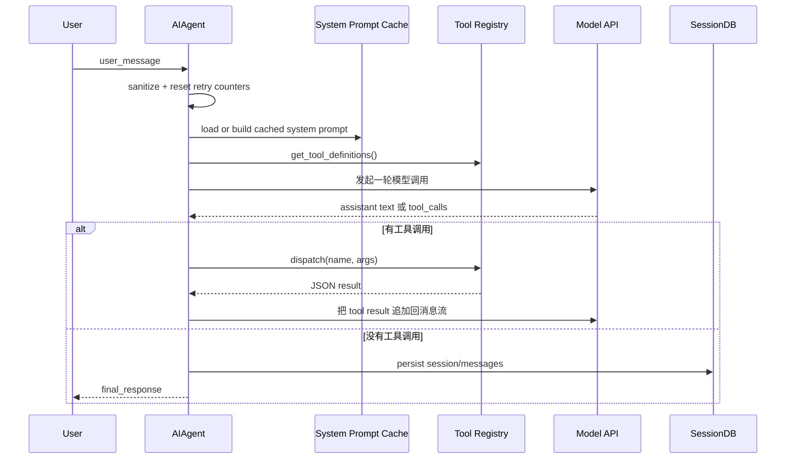
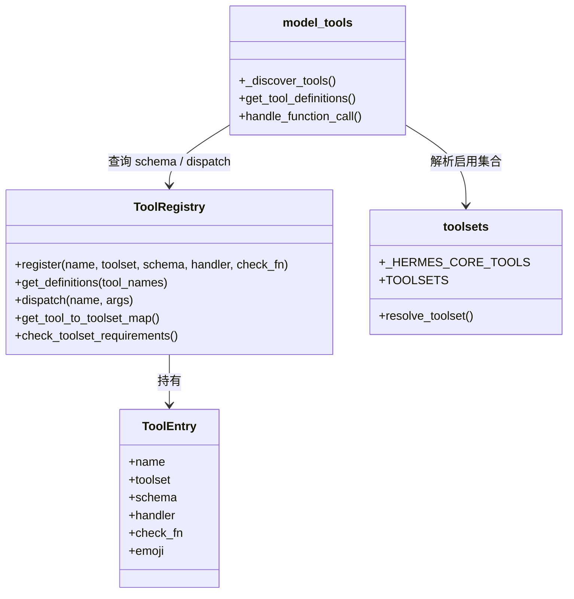
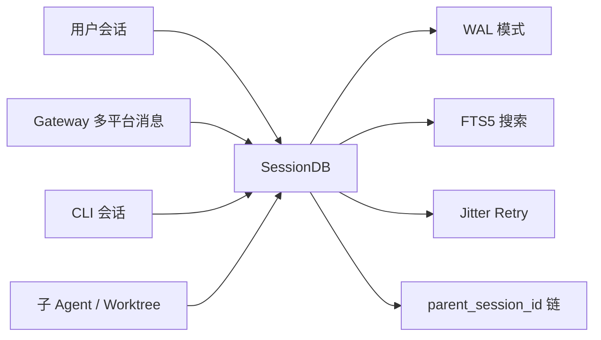

> **写作声明**：本文基于 2026 年 4 月 13 日我对 `hermes-agent` 本地仓库的一次完整阅读与拆解。正文由 Codex + GPT-5.4 使用 [卡兹克写作 Skill](https://github.com/KKKKhazix/khazix-skills) 辅助创作，文风遵循「数字生命卡兹克」公众号风格。

<video src="/uploads/hermes-agent-deep-dive/hermes-deep-dive-motion.mp4" poster="/uploads/hermes-agent-deep-dive/hero-cover.png" controls="controls" autoplay="autoplay" muted="muted" playsinline="playsinline" width="100%" style="border-radius: 12px;"></video>

## 事情是这样的

这两天我在翻一个 Python 项目。

翻着翻着，我有点上头。

不是因为它做了什么夸张的 benchmark，也不是因为 README 里塞了多少个 buzzword。恰恰相反，这个项目最打动我的地方，是一种很朴素的野心，它想做的不是一个会聊天的壳子，而是一个真正能长期陪你干活的 AI 助手。

项目叫 Hermes Agent。

你要是只看目录，第一反应可能是，哦，一个 agent 项目嘛，`run_agent.py`、`tools/`、`gateway/`、`tests/`，都挺正常。

但你继续往下翻，就会开始察觉不对劲。

光 Python 文件就有 855 个，总行数大约 38.8 万。测试文件 535 个。`run_agent.py` 一个文件 10800 行，`cli.py` 10060 行，`tools/mcp_tool.py` 2195 行，`hermes_state.py` 1238 行。

这种体量，已经不是那种「我周末搓了个 agent demo」的味道了。

它更像一个慢慢长出来的系统。

一个活系统。

## 先说结论

如果你问我，Hermes Agent 到底是什么。

我会给一个很不性感，但我觉得挺准确的回答。

它不是单纯的对话机器人，也不是把大模型 API 套上一层终端皮肤的 CLI。它更像一个四层咬合在一起的 AI 助手底盘。

第一层，是 `AIAgent` 这颗心脏，负责把一轮对话真的跑起来。

第二层，是 `registry + toolsets` 这一整套工具装配系统，决定模型到底能摸到什么手脚。

第三层，是 CLI、Gateway、ACP 这些交互表面，让同一个 agent 可以出现在终端、Telegram、Discord、Slack，甚至 IDE 里。

第四层，是 `SessionDB`、memory、skills、profiles 这些长期状态，让它不是一次性的问答，而是能积累，会延续，有记忆，有人格。

你想想看，这四层少一层都不行。

只有对话循环，没有状态，那它就是一次性的。

只有状态，没有交互表面，那它只是个库。

只有工具，没有装配系统，那它会越长越乱。

只有渠道，没有统一 runtime，那它迟早会裂成几套互相不认的东西。

这也是我看完 Hermes 之后最大的感受。

一个「活的」AI 助手，难点从来都不只是模型。

真正难的是，让模型、工具、界面、状态，这四件事像齿轮一样咬上。

## 第一章，心脏其实不是模型，是那条对话循环

Hermes 的核心入口在 `run_agent.py` 里的 `AIAgent`。

这个类很重。

不是那种「大而全所以难看」的重，而是你能明显感觉到，它在承担一个真实 runtime 的所有压力。

它要处理 provider 差异，要判断 `chat_completions`、`codex_responses`、`anthropic_messages` 走哪条路，要兼容 OpenRouter，要带上 reasoning config，要接住 stream callback、tool callback、status callback、clarify callback。

它甚至还要考虑 stale connection、fallback runtime、context pressure dedup、subagent delegation、compression warning 这种听着就很容易把人绕晕的边角问题。

这类代码读起来最容易让人厌烦。

因为太碎了。

但你真往下读到 `run_conversation()`，我反而觉得它有种很踏实的力量。Hermes 没有把最核心的循环藏得很深，它就是明明白白地告诉你，这一轮对话是怎么跑的。

Hermes 真正有意思的地方，不是这个循环本身，而是它在循环外面包了很多现实世界才会遇到的问题。

比如 system prompt 不是每轮都重建，而是缓存。

这个决定看起来很工程，很 boring，但特别关键。因为 prompt caching 一旦被你自己写代码写炸了，成本会直接上天。AGENTS 里甚至把这件事单独写成了高优先级约束，不能中途换 toolsets，不能随便重载 memory，不能随便重建 prompt。只有 context compression 才能动。

这背后其实是个挺成熟的产品意识。

不是先问架构优不优雅，而是先问，真实跑起来贵不贵，稳不稳。

再比如 `run_conversation()` 里面那一串 reset 和 preflight。

`_cleanup_dead_connections()`、`_restore_primary_runtime()`、各种 retry counter 清零、todo store hydration、memory nudge、session continuation 时复用历史 system prompt。

说真的，这些代码单拎出来都不性感。

但它们加在一起，就构成了一个真实 agent runtime 的手感。你会感觉这不是论文里的「智能体」，而是一个已经被用户、网络、平台、上下文窗口狠狠干过很多次之后，学会怎么自保的系统。

这块我很喜欢。

因为很多 agent 项目最大的问题就是，脑子特别大，身体特别虚。

Hermes 刚好反过来。

它没有先吹自己多智能，而是先把「一轮对话怎么稳定跑完」这件事做厚。

## 第二章，Hermes 最值钱的地方，也许是它的工具装配系统

如果说 `AIAgent` 是心脏，那 Hermes 的第二个灵魂部位，就是 `tools/registry.py` 和 `model_tools.py` 这套组合。

这玩意看上去很技术。

但你稍微站远一点看，会发现它其实是在回答一个所有 agent 都绕不开的问题。

模型，到底怎么知道自己能干什么。

Hermes 的答案不是把一坨 schema 手写死在某个巨大的配置文件里，也不是每加一个工具就到处改三四遍。它选了一条更像插件系统的路。

每个工具模块在 import 的时候自己 `registry.register()`。

`model_tools._discover_tools()` 只负责把工具模块 import 进来。

真正的 schema、handler、toolset membership、check_fn、emoji、max result size，都在 registry 里收口。

然后 `get_tool_definitions()` 再根据启用的 toolsets、禁用的 toolsets，以及每个工具的 `check_fn()` 动态决定，这一轮到底给模型暴露哪些工具。

这个设计的好处太直接了。

新增工具的时候，改动路径是清晰的。

写一个 `tools/your_tool.py`，注册。

在 `_discover_tools()` 里 import。

在 `toolsets.py` 里把它放进合适的集合。

完事。

不是哥们，这种可维护性，真的就是大型 agent 项目能不能活久一点的分水岭。

而且 Hermes 不是只有 registry，它还有一层 `toolsets.py`。

这层很像「使用场景编排器」。

`web`、`browser`、`file`、`memory`、`delegation`、`code_execution` 这些基础 toolset 是能力分组。

`debugging`、`safe` 这种更像策略分组。

再往上，`_HERMES_CORE_TOOLS` 这一大串，直接定义了 CLI 和 messaging platform 默认共享的核心能力面。

这个味道很重要。

因为很多 agent 项目会把「工具很多」误以为是「能力很强」。

但真实系统里，能力强从来不是工具数量决定的，而是装配关系决定的。

你让一个 Telegram bot 默认带上所有危险工具，那不是强，那是迟早翻车。

你让一个 coding 会话拿不到文件和终端，也不是安全，那是废了。

Hermes 在这块的克制，我觉得比它工具本身更值钱。它把「能不能用」「什么时候用」「在哪个平台用」拆开建模了。

这才像一个成年人会写的 agent。

## 第三章，CLI 那层皮，不是皮，是产品本体

我以前看很多开源 agent 项目，都会下意识觉得 CLI 只是个壳。

Hermes 不是。

你看 `hermes_cli/commands.py` 就知道，这个项目很清楚自己在做什么。它把 slash command 做成了一个中心注册表，`COMMAND_REGISTRY` 是单一真相源。

CLI help 从这里长出来。

Gateway help 从这里长出来。

Telegram BotCommand 菜单从这里长出来。

Slack subcommand routing 从这里长出来。

Autocomplete 还是从这里长出来。

这种设计有个特别朴素的优点。

你不会出现「CLI 有这个命令，Telegram 没有，help 文档忘了更新，alias 又漏了一份」这种很烦但超级常见的工程事故。

更让我有感觉的是，Hermes 没把命令系统理解成单纯的命令，而是把它当成「跟 agent 合作的手势系统」。

`/new`、`/clear`、`/history`、`/retry`、`/undo`、`/branch`、`/compress`、`/snapshot`、`/approve`、`/background`、`/btw`、`/queue`、`/profile`、`/model`、`/reasoning`、`/skin`、`/voice`、`/tools`、`/skills`、`/cron`、`/browser`……

这已经不是聊天了。

这是在操作一个 runtime。

你会发现 Hermes 的 CLI 其实有两个面孔。

一个面孔是聊天，像在跟一个 AI 助手说话。

另一个面孔是调度台，你可以切模型、调 reasoning、开 voice、切 skin、管工具、管 skills、管 cron、管 browser、管 snapshots。

这种双重身份非常像一个真正能长期使用的个人工具，而不是一个一次性的 demo。

还有个细节我很喜欢，`skin_engine.py` 竟然认真做了一整套主题皮肤系统。

很多人会觉得，这种花里胡哨的东西最后再做。

但我反而觉得，这恰恰说明 Hermes 没把自己只当成底层框架。它想要的是用户真的天天开着它。既然要天天开着，那视觉、交互、命令手感、提示节奏，就都不是小事。

说到这我有个挺强烈的感受。

Hermes 不是在造一个 API。

它是在造一个工作台。

## 第四章，真正把它从 demo 拉成系统的，是状态层

Hermes 还有一块很容易被忽略，但我觉得含金量极高的东西，就是 `hermes_state.py` 里的 `SessionDB`。

这东西一看就知道不是拍脑袋写的。

SQLite，WAL mode，FTS5 full-text search，schema version，session metadata，messages，reasoning，tool call 统计，token 统计，cost 统计，title，parent_session_id 链。

而且它还专门处理了多进程写争用。

不是直接迷信 SQLite 自带的 busy timeout，而是自己做了 jitter retry，20ms 到 150ms 的随机退避，配合 `BEGIN IMMEDIATE` 提前争抢 WAL write lock，避免 convoy effect。

这块特别有意思。

因为它暴露了一个现实，Hermes 不是单进程玩具。它真的预设了 CLI、Gateway、worktree agent、各种平台会同时碰同一个 `state.db`。

如果你没有被真实并发打过，是写不出这种代码味道的。

Hermes 在状态层最聪明的一点，是它没有只存聊天文本。

它存的是一个完整的会话轨迹。

模型、provider、token、cost、reasoning、tool calls、finish reason、session source，全都尽量存下来。

你想想看，这件事一旦做了，整个系统的上限就被抬高了。

你可以做 session search。

你可以做 usage analytics。

你可以做 insights。

你可以做多平台共享历史。

你甚至可以在未来接更多自动化能力，而不用把底层状态模型重写一遍。

说真的，很多 agent 项目都在狂堆 tool，我反而觉得像 `SessionDB` 这种东西，才是决定一个项目最终会不会变厚的关键。

因为工具解决的是「现在能干嘛」。

状态解决的是「明天还能不能接着干」。

## 第五章，为什么 Hermes 给我的感觉，比很多 agent 更像「活物」

写到这里，可能有朋友会想，这不就是一个做得比较完整的 agent 框架吗。

我非常理解这种感觉。

如果你平时不自己搭 agent，不自己折腾 CLI，也不怎么在 Telegram、Discord、Slack 这种渠道里长期跟 AI 协作，Hermes 看上去确实会像一套很复杂的工程堆栈。

但我自己的感受不是这样。

我觉得它最特别的地方，在于它没有把 agent 只理解成「推理加工具」。

它把 agent 理解成一种持续存在。

这种持续存在，至少要满足几件事。

你能在不同入口跟它相遇。

你上次说过什么，它尽量记得。

它手里拿到的能力，是按平台和场景装配过的。

它的状态和配置，不会因为换个入口就像失忆了一样。

它还能被你训练出一点个人味道，skills、profile、skin、memory，本质上都在往这个方向推。

这块让我想起一个很老，但一直不过时的判断。

好的个人软件，最后都会慢慢长出人格。

不是因为它会说俏皮话。

而是因为它开始理解你的工作方式、你的界面偏好、你的工具组合、你的习惯路径。

Hermes 在代码层面做的事，其实就是在搭这个人格的脚手架。

不是单纯让模型更会回答。

而是让整个系统更像「你的那一个」。

## 第六章，它也不是没有代价

当然，Hermes 不是没有问题。

而且这种项目的代价，其实还挺明显的。

第一，复杂度真的高。

`run_agent.py` 10800 行，`cli.py` 10060 行，这种文件体量带来的维护成本是实打实的。就算模块拆得还算讲道理，巨型核心文件本身也会让认知切换变得更吃力。

第二，它的工程重心很明确，所以学习门槛也会随之抬高。

profiles、skills、toolsets、gateway、callbacks、session continuation、provider routing，这些概念彼此之间是联动的。你想真正改 Hermes，不是学会一两个函数就够了，你得吃透它的运行模型。

第三，Prompt caching 这条约束把很多「看起来合理」的重构都直接封死了。

这事没法抱怨。

因为真实产品里，成本就是约束本身。

但这也意味着，Hermes 的很多代码不能只按「好不好看」来改，得按「会不会把缓存命中率打碎」来改。

这就很工程。

也很现实。

不过坦率地讲，我反而更愿意相信一个把这些代价写进 AGENTS 的项目。

因为它至少没有装。

它知道自己哪里复杂，哪里脆，哪里不能乱碰。

这种诚实，比很多架构图都值钱。

## 最后聊聊我真正被它打动的地方

我翻这类项目的时候，经常会有一种失望。

不是代码写得差。

而是你翻到最后会发现，它其实并不真的想活到现实世界里，它只想在一个漂亮的 demo 里成立。

Hermes 不是这种项目。

它明显是想活到现实里的。

它关心 Telegram。

关心 Slack。

关心 Gateway。

关心 SessionDB 的锁争用。

关心 profiles 会不会串状态。

关心 tool schema 里别乱提别的工具名字，不然模型会幻觉。

关心 prompt cache 会不会被你重建系统提示词这件事狠狠干碎。

这些细节单独看，都不浪漫。

但全部叠在一起，就很浪漫了。

因为你会意识到，真正的 AI 助手不是靠一句「我会用工具」诞生的。

它是靠无数这种现实到甚至有点琐碎的工程判断，一点一点堆出来的。

我一直觉得，AI 时代最稀缺的能力之一，不是会调模型。

而是会把模型放进一个能长期运转的系统里。

Hermes Agent 让我看到的，恰恰就是这种能力。

不是最炫的那种。

但很硬。

也很真。

如果你最近也在想，agent 到底该怎么从 demo 走到产品，怎么从一轮调用走到长期协作，Hermes 这套代码，我是真建议你找个晚上翻一翻。

你未必会照着它做。

但你大概率会开始重新理解，什么叫一个「活的」AI 助手。

以上，既然看到这里了，如果觉得不错，随手点个赞、在看、转发三连吧，如果想第一时间收到推送，也可以给我个星标⭐～
谢谢你看我的文章，我们，下次再见。

> / 作者，卡兹克风格辅助创作
> / 项目，Hermes Agent
