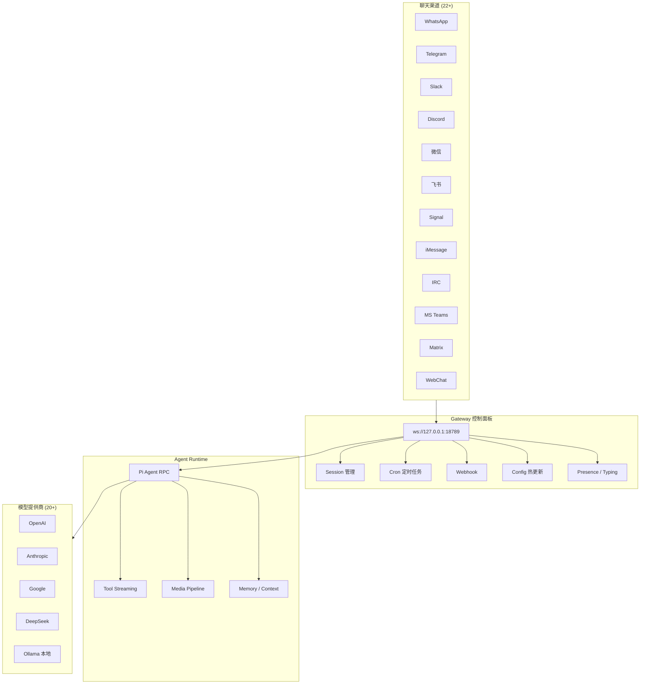
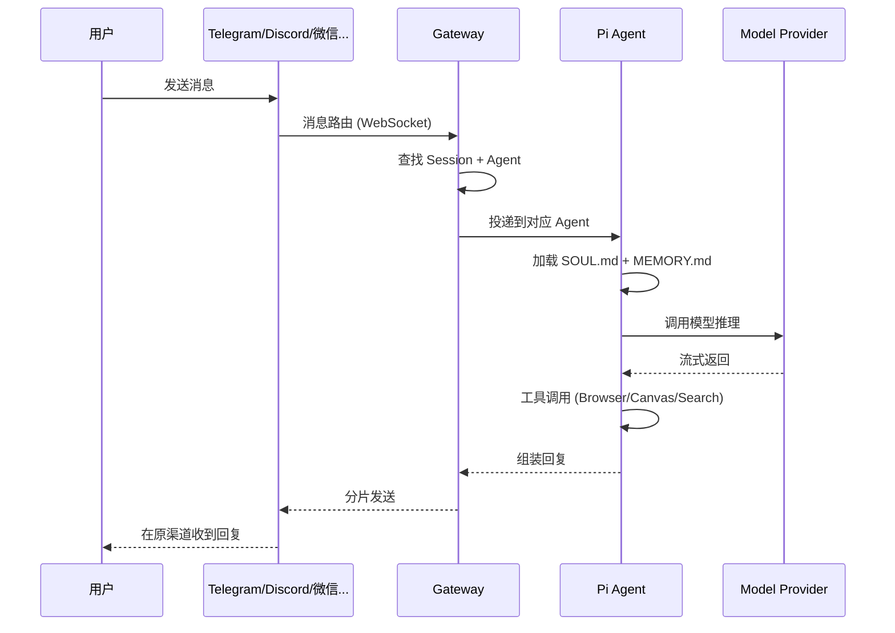
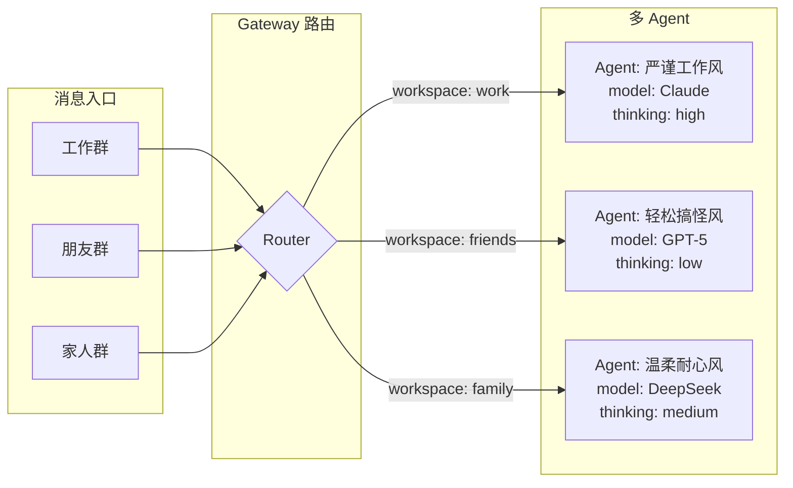
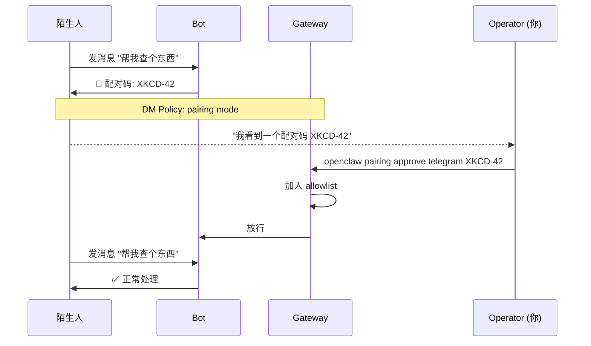
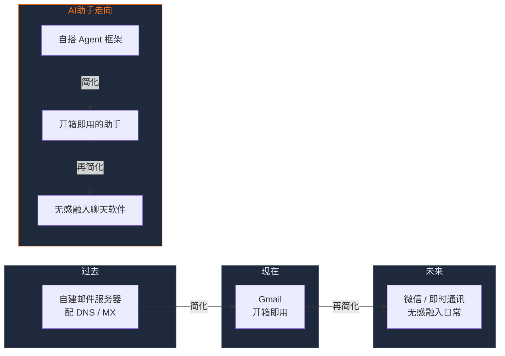

> **写作声明**：本文由 Claude Code + GLM-5.1 使用 [卡兹克写作 Skill](https://github.com/KKKKhazix/khazix-skills) 辅助创作，文风遵循「数字生命卡兹克」公众号风格。

<video src="/uploads/openclaw-personal-ai-assistant-deep-dive/openclaw-video.mp4" controls="controls" width="100%" style="border-radius: 12px;"></video>

事情是这样的。

这两天我在翻一个开源项目，翻着翻着，给我整个人干懵了。

不是因为什么花哨的demo，也不是因为哪个炸裂的功能。是因为我在它的git log里看到了一个数字，30000。

三万次提交。

我反复确认了好几遍，没看错。这个项目从第一次提交到现在，大约五个月。五个月，三万次commit。平均每天200次。

我寻思了一下，我没寻思明白。

这个项目叫OpenClaw。

一个个人AI助手。

你可能觉得，又是一个AI助手，这年头谁还没做过AI助手。大大小小的AI助手项目我见过太多了，从AutoGPT到各种Agent框架，每次出来都号称要改变世界，然后呢，大多数要么变成Star数很高但没人用的吉祥物，要么就是某个大厂产品的一个Feature。

但这个不太一样。

它的核心思路就一句话，你的AI，在你的设备上，跑在你已经在用的聊天软件里。

## 22个聊天渠道，一个AI助手

听起来很简单对吧。但我跟你说，能把这么简单的一件事做成的人，真的不多。

我们先聊聊它到底是个什么东西。

OpenClaw的定位非常明确，personal AI assistant，个人AI助手。不是给企业用的客服系统，不是给开发者的Agent框架，就是给你个人用的，一个助手。

你装好之后，它会起一个Gateway，就是一个控制中心，跑在你自己机器上，然后你可以把它接上你所有的聊天渠道。

WhatsApp，Telegram，Slack，Discord，Google Chat，Signal，iMessage，IRC，Microsoft Teams，Matrix，飞书，LINE，Mattermost，Nextcloud Talk，Nostr，Synology Chat，Tlon，Twitch，Zalo，微信，WebChat。

我数了一下，22个。

22个聊天渠道。

你想想看，现在大家手机里装了多少个聊天软件。我有微信，有Telegram，有Slack，有Discord，有飞书。每个里面都可能有人找我，每个里面我都可能需要AI帮忙。以前我得在每个app里分别搞一个bot，分别配一遍API Key，分别调一遍prompt。

OpenClaw的思路是，不用。你只需要一个Gateway，然后22个渠道全部打通。不管谁在哪个app找你，AI都能接住，而且用的是同一个上下文，同一套记忆，同一个人格。

这个思路真的太对了。

因为人跟AI的交互，最自然的形态不是打开一个专门的app去聊天，而是在你已经在用的地方直接跟它说话。你在Telegram里问它今天天气怎么样，在Slack里让它帮你总结一下会议纪要，在微信里让它帮你翻译一段话，它都在，都是同一个它。

然后我就开始翻它的源码。

## 6500个文件，105个插件，128万行代码

这个项目的规模让我有点震惊。6500多个TypeScript文件，128万行代码。105个扩展插件。

我分别翻了翻它的目录结构，src下面有50多个子目录，从agents到config，从gateway到routing，从media到security，从tts到web-search。你能想到的一个AI助手该有的模块，它基本上全有。

而且它还有一个非常成熟的插件系统。

光是模型提供商就有OpenAI、Anthropic、Google、DeepSeek、Mistral、Groq、Ollama、HuggingFace、NVIDIA、xAI、Amazon Bedrock等等等等，我数了大概20多个模型提供商。搜索方面有Brave、DuckDuckGo、Tavily、Exa、Perplexity、SearXNG。语音有ElevenLabs、Deepgram。还有浏览器控制、图像生成、视频生成、内存管理……

这不是一个side project。这是一个完整的、深思熟虑的产品级系统。

但让我真正被震撼到的，不是代码量，不是功能多。

是它的架构设计。

## Gateway，多Agent路由，模型无关

我看了它的架构图，所有的聊天渠道在上面，全部汇入一个Gateway控制面板。Gateway下面分出几条线，一条连到Pi agent runtime，就是AI的核心推理引擎，一条连到CLI命令行，一条连到WebChat界面，一条连到macOS原生app，一条连到iOS和Android的node。

这个架构设计的精髓在于，Gateway不是AI本身，它只是一个控制面板。AI的推理可以跑在任何模型提供商上，Gateway负责的是把消息从各个渠道收进来，交给agent处理，再把结果送回去。它还管理session、presence、cron任务、webhook，所有这些杂活都是Gateway在干。

说真的，这个思路非常聪明。

因为这意味着你的AI助手不是绑定在某个特定的模型上。你今天用Claude，明天想换GPT-5，后天想试试本地的Llama，都可以。Gateway不关心你用什么模型，它只负责消息路由和会话管理。

看看这个消息流。你在任何一个聊天app里发一条消息，它会先到达Gateway，Gateway根据你的身份和渠道找到对应的Agent，Agent加载人格和记忆文件，然后调用模型推理，如果有需要还会调工具，最后把结果送回你发消息的那个app。

整个过程你是无感的。你只是在一个聊天框里打了一行字，然后收到了回复。但背后跑了一整套消息路由、会话管理、模型推理、工具调用的链路。

然后它还有一个更骚的操作，多agent路由。

你可以设置不同的agent，让不同的聊天渠道甚至不同的联系人路由到不同的agent。比如你的工作群用一个严谨的agent，你的朋友群用一个会开玩笑的agent，你的家人群用一个耐心的agent。每个agent有自己的workspace、自己的session、自己的人格。

这个功能太戳我了。

因为一个真实的需求场景是，你不可能让一个AI人格适应所有人。面对老板你得正经一点，面对哥们儿你可以放飞一点，面对你妈你得耐心一点。如果你只有一个AI人格，它要么在老板面前太轻浮，要么在哥们儿面前太无聊。多agent路由直接解决了这个问题。

说到这里，我不得不提一下这个项目背后的主要贡献者。

## 一个人写了62%的代码

Peter Steinberger。

19284次提交，占总提交量的62%。

如果你关注iOS开发圈，你可能听过这个名字。他是PSPDFKit的创始人，做PDF SDK的，在iOS开发圈子里算是大佬级别的存在。

但让我佩服的不是他的技术背景，而是他对这个项目的投入程度。

五个月，19284次提交。算一下，平均每天130次。这不只是在写代码了，这是在用命做产品。

然后第二名的贡献者是Vincent Koc，4067次提交。第三名Tak Hoffman，1122次。再往后就不超过1100了。

这基本就是一个超级个体的作品，加上一些核心贡献者的辅助。

我有时候觉得，开源世界最迷人的就是这种故事。一个人，或者说极少数人，凭着一股子执念，用五个月时间硬生生造出了一个128万行代码的系统。

105个插件，22个聊天渠道，三个平台的companion app（macOS、iOS、Android），还有语音唤醒、Canvas画布、浏览器控制、定时任务……

这是真的在用认真的态度在做事。

对了，这个项目的名字也有意思。

## 四次改名，从个人实验到开源生态

它经历了四次改名。Warelay → Clawdbot → Moltbot → OpenClaw。

从VISION.md里的描述来看，它最早是Peter自己的个人实验项目，想做一个能真正在电脑上干活的AI助手。一开始叫Warelay，后来改成Clawdbot，再改成Moltbot，最后定名OpenClaw。

四次改名本身就是一个信号。说明这个项目在持续进化，每一次进化都伴随着定位的调整，直到最后找到了一个真正合适的身份。

OpenClaw这个名字，Open代表开源，Claw是龙虾的钳子，Logo也是一只龙虾。README里写着「EXFOLIATE! EXFOLIATE!」，就是一只龙虾喊着「蜕壳！蜕壳！」，挺抽象的，但莫名觉得挺酷。

然后是它的技术选型。

## hackable by default

TypeScript。

VISION.md里有一段专门解释了为什么选TypeScript，核心意思就是三个字，可Hack。原文是这么说的，「TypeScript was chosen to keep OpenClaw hackable by default. It is widely known, fast to iterate in, and easy to read, modify, and extend.」

hackable by default，默认可Hack。

这句话太重要了。

因为很多AI助手项目犯的一个错误是，把系统做得太封闭了。你用它得按它的规则来，想定制一下就得啃一堆文档。但OpenClaw的思路是，我给你一个完整的TypeScript代码库，你想改就改，想加就加，想删就删。你是这个系统的主人，不是租客。

这也是为什么它有105个插件。因为它的插件系统设计得足够开放，任何人都可以写一个插件来扩展功能。而且它的插件不局限于聊天渠道或模型提供商，还有像memory-lancedb（向量数据库记忆）、browser（浏览器控制）、phone-control（手机控制）这种能力插件。

你甚至可以用它来控制你的手机摄像头拍照，录屏，获取地理位置，读取通知。

这不是一个聊天机器人。

这是一个真正意义上的个人AI操作系统。

说到安全感，OpenClaw在这块做得很认真。

## 默认锁死，安全不是可选项

它默认的DM策略是pairing模式，就是不认识的人给你发消息，bot不会直接处理，而是让对方输入一个配对码。你得在本地手动approve这个配对码，对方才能跟你的AI对话。

这个设计特别关键。因为你的AI助手是直接连在你的聊天账号上的，如果任何人都能跟它说话，那就等于任何人都能通过你的AI访问你的信息。配对码机制确保了只有你信任的人才能跟你的AI交互。

还有一个doctor命令，专门检查你的配置有没有安全隐患。跑一下openclaw doctor，它会告诉你哪些设置可能不安全，哪些渠道的DM策略太开放了。

这种安全意识在开源AI项目里其实挺罕见的。很多项目默认就是全开的，安全你自己管。OpenClaw反过来，默认锁死，你想开放得自己显式操作。

这个设计哲学我很认同，也是这个项目让我觉得靠谱的一个原因。

然后还有几个我觉得特别有意思的功能。

## 语音唤醒、Canvas画布、浏览器控制

语音唤醒。在macOS和iOS上，你可以用唤醒词来激活AI。就是你对着手机喊一声，AI就开始听了。配合ElevenLabs的TTS，它还能用自然的声音回复你。不是那种机器人味的TTS，是比较接近真人的声音。

Canvas画布。这个概念很新，就是AI可以在你的设备上打开一个实时的可视化工作区。你可以理解为AI的「桌面」，它可以在上面展示图表、文档、交互组件，你也能直接在上面操作。

浏览器控制。OpenClaw可以启动一个专用的Chrome/Chromium实例，帮你在网上查资料、填表单、截图、上传文件。

定时任务。你可以让AI在特定时间做特定的事，比如每天早上8点总结一下未读消息，每周一生成一份周报。

这些功能单独拿出来都不算新鲜。但当一个项目把它们全部整合到一起，再通过22个聊天渠道无差别地触达你的时候，那个感觉就不一样了。

你可以在Telegram里对AI说「帮我截个图」，它就在你的电脑上截个图发给你。你可以在微信里说「今天有什么新闻」，它就去搜一下然后用中文给你总结。你可以在Slack里说「帮我把这个会议录一下」，它就调起语音转录。

所有的操作，不管多复杂，入口都是一个自然语言消息。不管你在哪个app，入口都是一样的。

这就是我觉得OpenClaw真正做对的地方。它把复杂的东西藏到了后面，给用户呈现的就是一个极其简单的交互界面，聊天框。

翻完这个项目之后，我坐在那想了一会儿。

## AI助手的终局，是「无处不在」

我在想一个更大的问题，个人AI助手的终局到底是什么形态。

现在市面上的AI产品，大致分几类。一类是ChatGPT、Claude这种对话式的，你打开网页或者app跟它聊。一类是各种Agent框架，给开发者用的，你得自己搭。一类是各种垂直场景的AI工具，帮你写代码的、帮你画图的、帮你做PPT的。

但好像没有一个产品，真正做到了「你的AI，无处不在」。

OpenClaw在试图做这件事。

它不是要替代ChatGPT，也不是要替代Claude。它要做的，是把你选择的AI模型，变成一个真正融入你生活的助手。不是让你去某个特定的app找AI，而是让AI在你已经在用的每一个角落等着你。

这个愿景很大。大到我觉得五个月的时间还远远不够。

但你看看那三万次提交，看看那128万行代码，看看那105个插件，你会觉得，也许这个人能做到。

其实吧，我一直觉得AI助手这个品类，最终赢的不会是模型最强的那个。因为模型能力在趋同，Claude强的地方GPT也会追上来，GPT强的地方Claude也会追上来。

最终赢的，是那个离用户最近的。

不是在浏览器里等你打开的那个，而是在你微信里、在你Telegram里、在你Slack里，随时都在的那个。

OpenClaw在往这个方向走。

我不知道它最后能不能走到。但这五个月的三万次提交告诉我，有人在非常认真地往这个方向走。

这让我想起一个事。互联网早期，电子邮件是唯一的选择。你得自己架邮件服务器，配DNS，搞MX记录。后来有了Gmail，邮箱变成了一个开箱即用的服务。再后来，微信把通讯这件事做到了极致，你不需要知道对方用什么邮箱，扫个码就能联系上。

AI助手可能也在走同样的路。从你自己搭框架，到开箱即用的服务，到无感融入你的日常。

OpenClaw现在大概在第一阶段和第二阶段之间。你能用，但搭建过程还是需要一些技术背景。不过看看它的发展速度，也许很快就不需要了。

我自己的感受是，翻了这么多开源项目，OpenClaw是少数让我觉得「这玩意是真的在解决一个真实问题」的项目。

不是在炫技，不是在做demo，不是在造一个用来融资的故事。就是一个认真的人，在认真做一个他觉得对的东西。

就冲这一点，值得被更多人看到。

如果你感兴趣，GitHub上搜openclaw/openclaw就能找到。MIT协议，代码全开。想试试的话，装好Node 22以上，`npm install -g openclaw@latest`，然后跑`openclaw onboard`，它会一步步带你走完配置。

说真的我也不确定这东西最终会不会成为主流。但我觉得，能花五个月时间，用三万次提交，去认真探索「AI助手应该是什么样」这件事本身，就已经很酷了。
